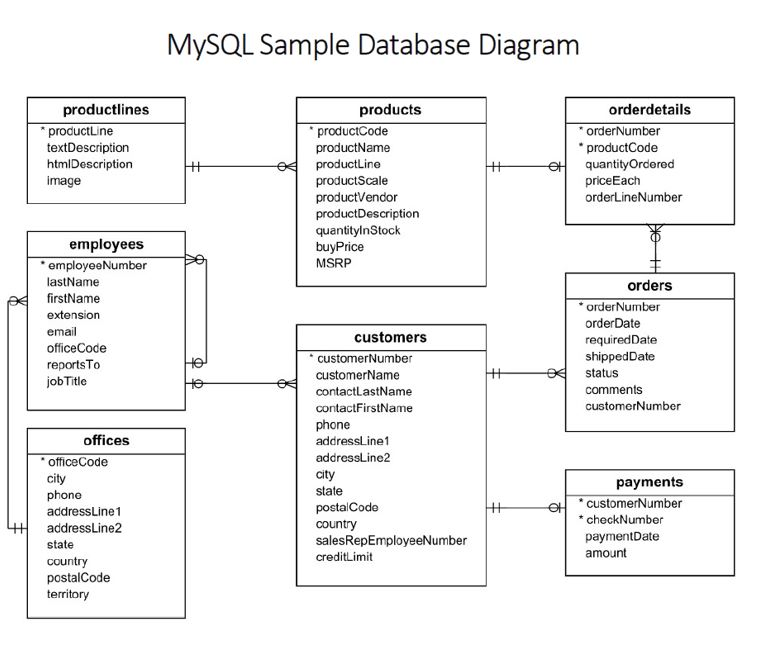

# Mastering SQL for Data Analytics with the Classic Models Database

This project showcases practical SQL queries using the Classic Models sample database to solve real-world data analytics problems. Topics covered include sales analysis, customer behavior, and performance metrics.

## 📌 Key Features
- Join queries across multiple tables
- Grouping, aggregations, filtering
- Calculating average order amounts, best-selling products, profit per product, and more
- Co-purchase pattern analysis

## 🛠 Technologies
- MySQL
- MySQL Workbench
- SQL

## 📈 Sample Use Cases
- Total sales by product line
- Top 10 best-selling products
- Sales performance by representative
- Orders shipped on time

## 📁 Files
- `classicmodels_queries.sql` – Contains all SQL queries
- `classicmodels_schema.jpg` – ERD of the Classic Models database

## 🚀 Getting Started
1. Load the Classic Models database into your MySQL instance.
2. Open `classicmodels_queries.sql` in MySQL Workbench or your SQL editor.
3. Run queries and explore insights.

## 📸 Screenshot

## 📚 License
MIT License

